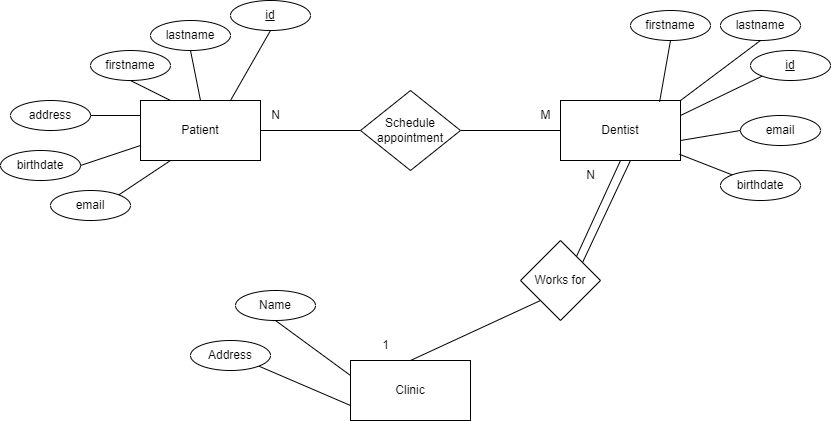

# java-rest-api
Simple project to learn the Java Spring Boot framework and Docker

# Purpose

As a software engineering student I learnt and practiced the implementation of a web application
using node js with express to implement its backend as part of a group project. However, looking through LinkedIn
job posts, I noticed that many companies use Java with the Spring Boot framework. Many posts would also cite 
technologies such as Docker and containers. Therefore, aiming to broaden my technical repertory, I decided to start
this small project to: 

- Learn how to implement a restful API with Java and Spring Boot

- Learn more about GitHub actions for CI/CD

- Learn about Docker and Containers

- Practice and showcase my version control and repository management skills

# Project description

The project context is inspired by the project's description in the DIT356: Ditstributed Systems Development course at the University of Gothenburg.

This project is an API for a dentist appointment system. The entities of the system are Clinic, Dentist and Patient. Their interaction can be seen in the following ER diagram:

